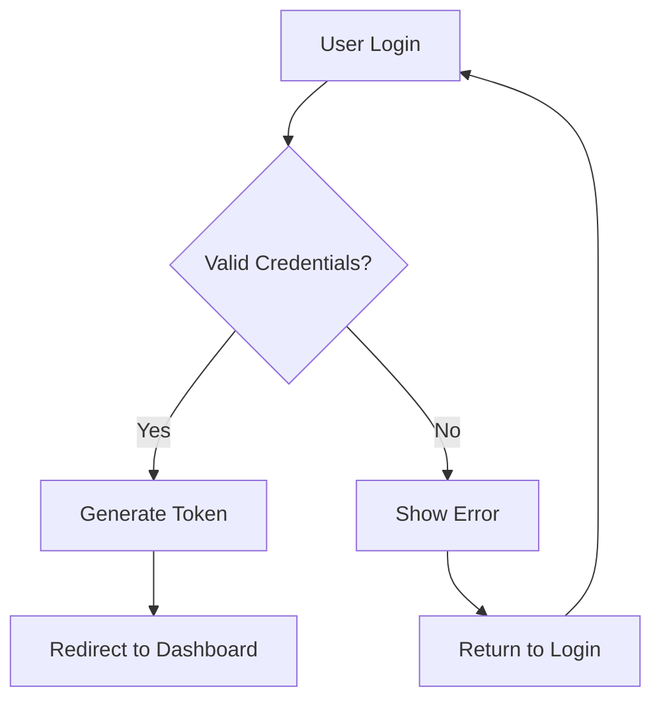
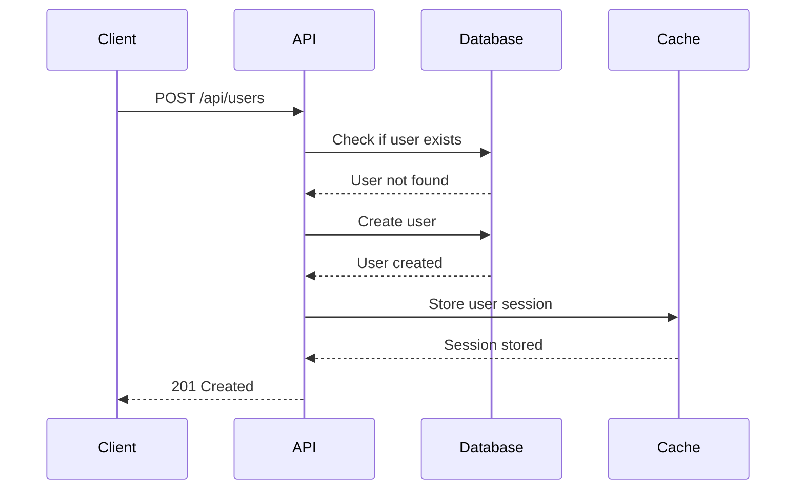
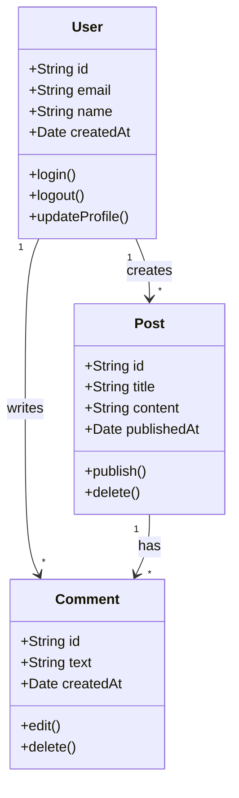
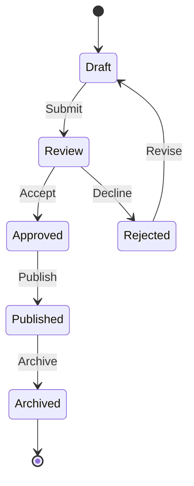
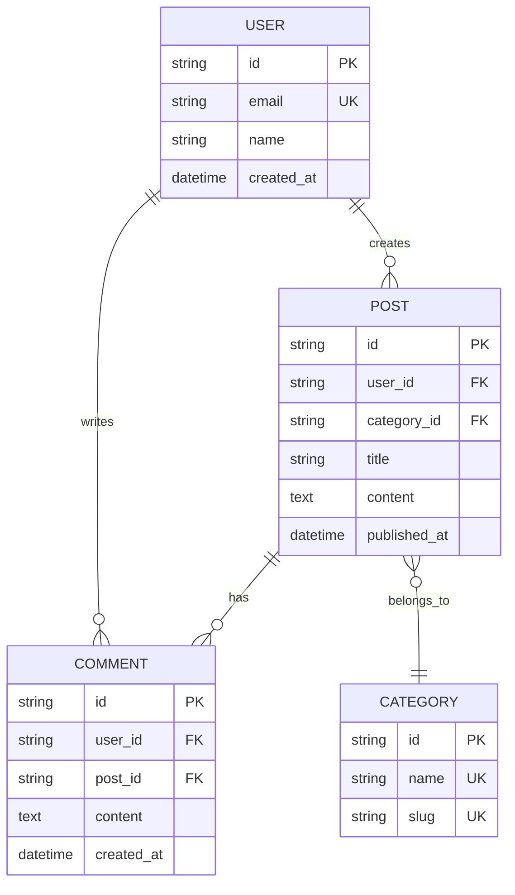
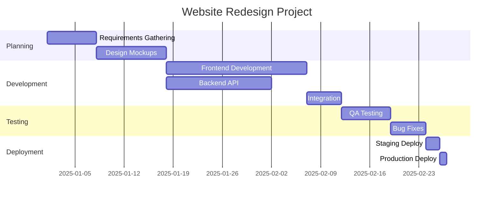
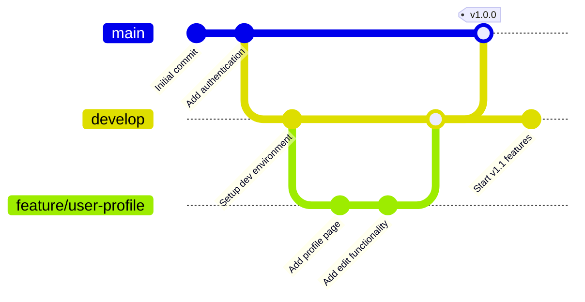
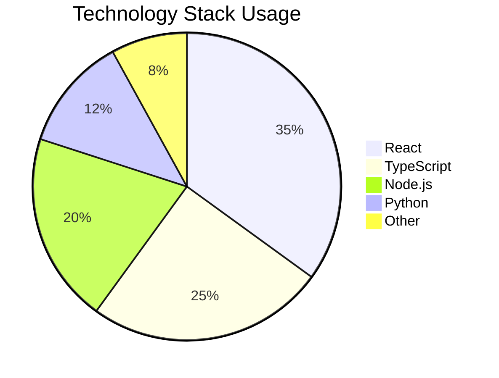

export const metadata = {
  title: "Visualizing Complex Concepts with Mermaid Diagrams | Shakirul Hasan Khan",
  description:
    "Explore the power of Mermaid diagrams for creating beautiful flowcharts, sequence diagrams, and more directly in your blog posts",
  openGraph: {
    title: "Visualizing Complex Concepts with Mermaid Diagrams",
    description:
      "Explore the power of Mermaid diagrams for creating beautiful flowcharts, sequence diagrams, and more directly in your blog posts",
    type: "article",
    publishedTime: "2025-01-15",
    authors: ["Shakirul Hasan Khan"],
    tags: ["diagrams", "visualization", "documentation", "mermaid"],
  },
  twitter: {
    card: "summary_large_image",
    title: "Visualizing Complex Concepts with Mermaid Diagrams",
    description:
      "Explore the power of Mermaid diagrams for creating beautiful flowcharts, sequence diagrams, and more directly in your blog posts",
  },
};

# Visualizing Complex Concepts with Mermaid Diagrams

As developers and technical writers, we often need to explain complex systems, workflows, and architectures.
While text is powerful, visual diagrams can convey information much more efficiently.
This is where Mermaid comes in - a powerful tool that lets you create diagrams using simple text syntax.

## What is Mermaid?

Mermaid is a JavaScript-based diagramming and charting tool that renders Markdown-inspired text definitions to create and modify diagrams dynamically.
It supports various diagram types including flowcharts, sequence diagrams, class diagrams, state diagrams, and more.

Let's explore some examples!

## Flowcharts

Flowcharts are perfect for visualizing decision-making processes and workflows.
Here's an example of a user authentication flow:

## Sequence Diagrams

Sequence diagrams show how processes interact with each other and in what order.
This is particularly useful for API documentation:

## Class Diagrams

Class diagrams are essential for documenting object-oriented architectures:

## State Diagrams

State diagrams help visualize the different states an object can be in:

## Entity Relationship Diagrams

ER diagrams are perfect for database schema documentation:

## Gantt Charts

Project timelines and schedules are easy to visualize with Gantt charts:

## Git Graph

Visualize Git workflows and branching strategies:

## Pie Charts

Simple data visualization with pie charts:

## Why Use Mermaid?

1. **Version Control Friendly**: Diagrams are text-based, so they work perfectly with Git
2. **Easy to Update**: No need to open external tools - just edit the text
3. **Consistent Styling**: All diagrams follow a consistent visual theme
4. **No External Dependencies**: Everything renders in the browser
5. **Documentation as Code**: Keep diagrams close to your code

## Conclusion

Mermaid diagrams are a powerful tool for creating clear, maintainable documentation.
They bridge the gap between code and visual communication, making it easier to explain complex concepts to both technical and non-technical audiences.

The best part? You can create all these diagrams with just a few lines of text, and they'll always stay in sync with your documentation!

---

For more information about Mermaid syntax, visit the [official documentation](https://mermaid.js.org/).
